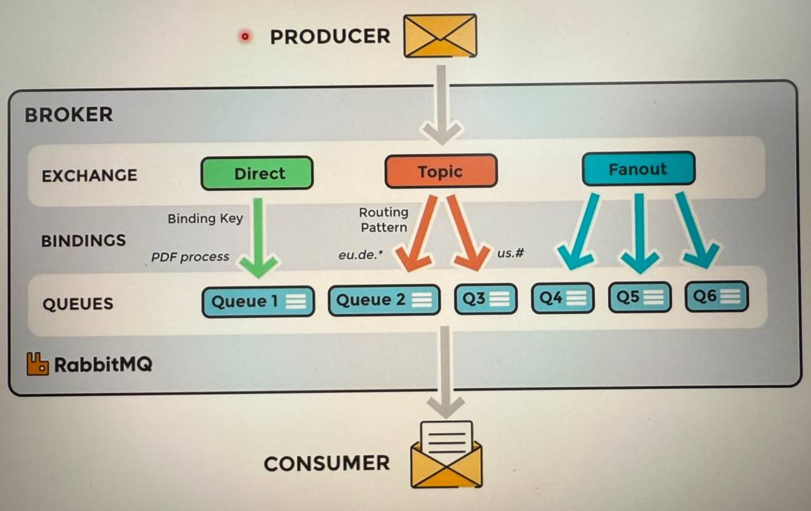

## Lecture 270. What is RabbitM and its main components.

- RabbitMQ is a message broker software that implements the AMQP (Advanced Message Queing Protocol).
- Similar softwares: Apache Kafka, Msmq, Microsoft Azure Service Bus, Kestrel, ActiveMQ and so on.
- All transactions can be listed in a queue until the source to be transmitted (consumer) gets up.
- Allows to send and receive messages asynchronously.
- RabbitMQ supported for multiple operating systems and has open source code.

Main components: Producer, Queue, Consumer, Message, Exchange, Binding and FIFO principle.

- Producer - source of the messages, service that produces messages.
- Queue - place where the messages are stored.
- Consumer - service which consumes the message and process some actions
- Exchange - structure which decides to which queue to send the message.
- Binding - link between exchange and a queue.